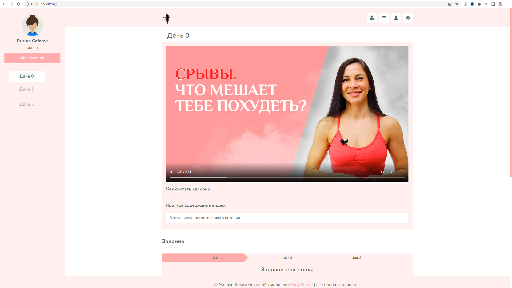
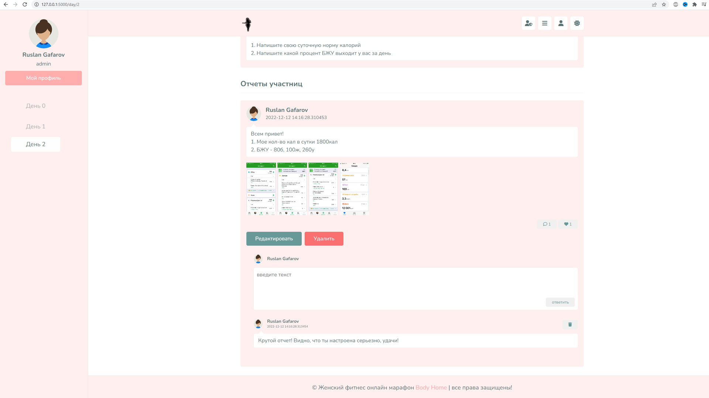
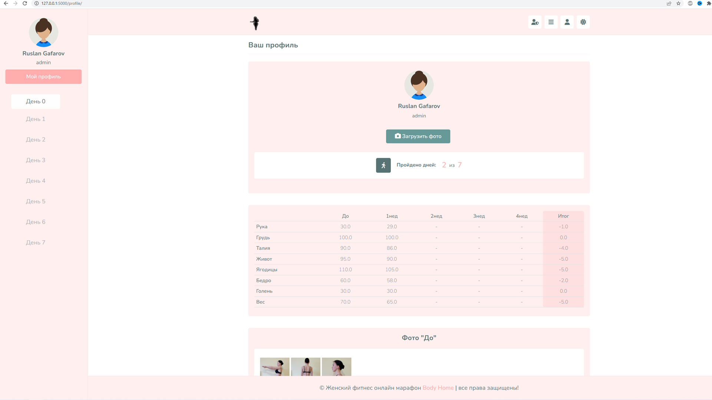
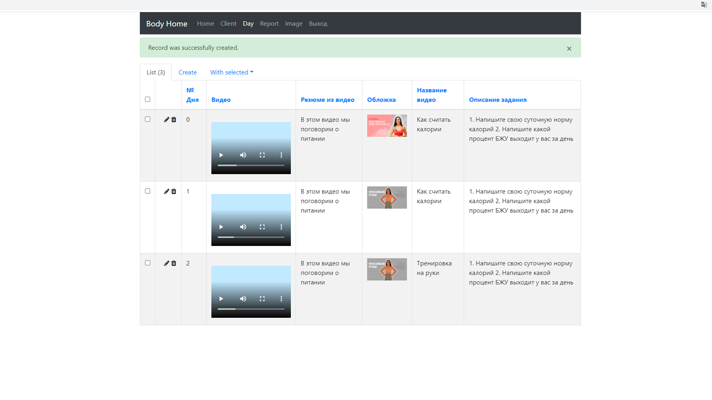
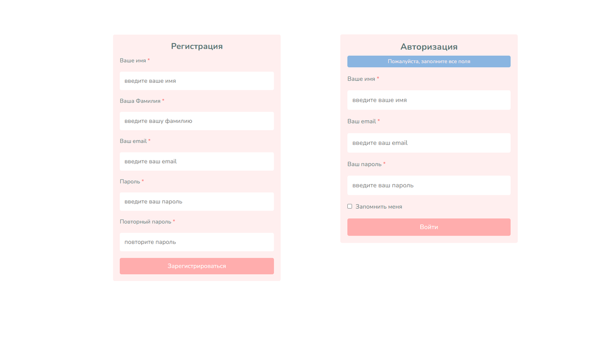
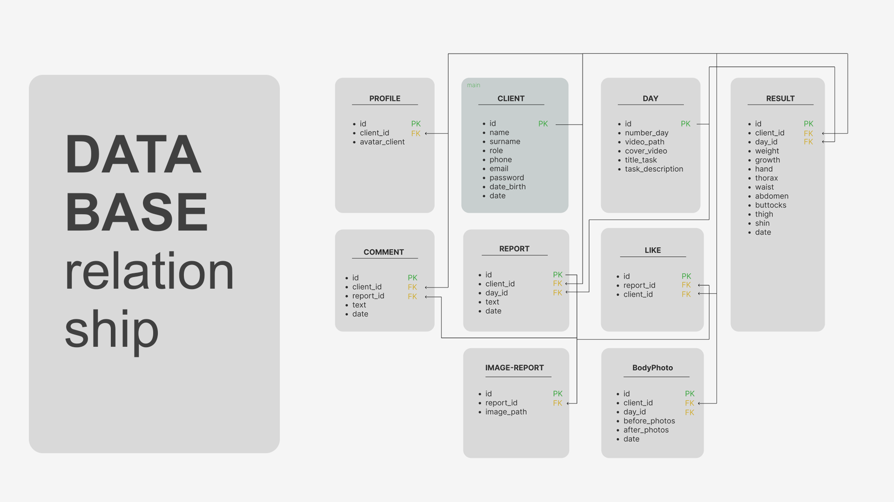

# Body Home
 

**Body Home** - это веб приложение для женщин, которые хотят похудеть в домашних условиях.

## **Что реализовано**

**1. Страница одного из дней в онлайн курсе, в которой можно:**
+ [X] Просмотром видео тренировки или лекции по питанию.
+ [X] Добавление своего отчета (текст и фото своей еды).
+ [X] Редактирование и/или удаление своего отчета.
+ [X] Добавление комментария к отчету.
+ [X] Добавление лайков :+1: к отчету через js(fetch())
+ [X] Удобная навигация по дням курса с помощью адаптивного меню.
+ [X] Просмотр отчетов других участниц в этом дне.

*Просмотр видео*

 
 
*Добавлеине отчетов, комментариев, лайков*

##

**2. Сбор и сохранение замеров:**
+ [X] Меняющиеся формы сделаны на js.

 
 
##

**3. Профиль клиента, где есть:**
+ [X] Возможность загрузить свой аватар.
+ [X] Посмотреть на таблицу с замерами и увидеть свои результаты.
+ [X] Разместить фото "ДО ПОСЛЕ".

 
 
 
##

**4. Админ панель, в которой можно:**
+ [X] Просматривать| добавлять| удалять| редактировать всех пользователей из БД. А так же менять роль с studen на admin.
+ [X] Создавать новые дни в онлайн курсу: добавлять новые видео, описание, задание.
+ [X] Просмотривать| удалять клиентские отчеты.

 
 
 
##

**5. Регистрация новых пользователей:**
+ [X] Проверка через flask-security.
+ [X] Создание hash pasword.

 
 
##

**6. Создание БД и связи между таблицами:**
+ [X] Использовал flask-sqlalchemy.
+ [X] Добавление новых таблиц и связей flask-migrate.

##
